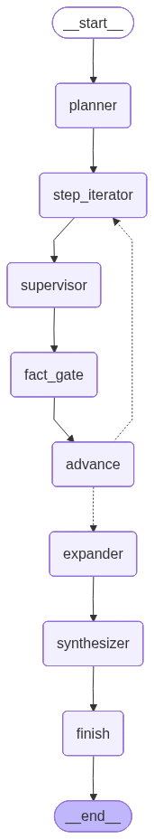

# DeepResearch

DeepResearch is an experimental, **plan-driven research workflow** built with LangGraph + LangChain.  
It composes a small set of nodes (planner → supervisor → fact gate → expander → synthesizer) and a single worker agent (arXiv) into a loop that **collects citations**, **enriches them with focused summaries**, and **synthesizes** a final write-up.

---

## Architecture

### High-level flow
1. **planner**  
   Uses an LLM with structured output to convert a topic into a `Plan`:
   - `main_query` (seed query)
   - ordered `steps` (`task`, `expected_output`)
   - `success_criteria`  
   If no plan exists (or is empty), the planner generates one and resets `step_idx`.

2. **step_iterator**  
   Emits a single **PLAN STEP** as a `HumanMessage` to the supervisor, **clearing transient buffers per step**:
   - resets `step_citation_count = 0`
   - clears `pending_facts` using the `PENDING_CLEAR` sentinel  
   The message includes the current task, expected output, and topic, and instructs workers to end with a strict `==DELIVERABLE==` block.

3. **supervisor**  
   A compiled supervisor (`langgraph_supervisor.create_supervisor`) that:
   - delegates the step to exactly one agent (currently the **arxiv_agent**)
   - keeps responses terse and step-scoped
   - collects only the worker’s **last message** (`output_mode="last_message"`) for evaluation/hand-off

4. **arxiv_agent (worker)**  
   A ReAct agent with two tools:
   - `arxiv_search` – searches arXiv (configurable `top_k` through `RunnableConfig`)
   - `add_scholar_reference_tool` – **writes** citations into the blackboard by returning a `Command(update=...)` that appends to `pending_facts` and sends a `ToolMessage` ack  
   The agent is constrained to **add at most 3 high-signal papers**, then must output a `==DELIVERABLE==` section.

5. **fact_gate**  
   Admits at most **K** new `scholar_reference` facts **per step** (`max_citations_per_step` via `configurable`).  
   - Dedupe strategy uses a stable key: `arxiv_id` → `doi` → normalized `url` → `(title|year)`  
   - Increments `step_citation_count` and clears `pending_facts` after admitting.

6. **advance**  
   Increments `step_idx`. If there are remaining plan steps, loops back to **step_iterator**; otherwise goes to **expander**.

7. **expander**  
   For each admitted `scholar_reference`:
   - attempts to download the **arXiv PDF** and extract text (PyPDF2); if unavailable, falls back to `ArxivAPIWrapper.run()` (abstract/metadata)
   - asks an LLM to write a **focused extended summary (150–300 words)** tied to the main topic
   - appends a **new** `scholar_reference` fact with the `extended_summary` filled (no in-place mutation; reducers handle merging).

8. **synthesizer**  
   Builds the final markdown answer using **only citations that have `extended_summary`**.  
   - Collapses duplicates (latest wins by key)  
   - Produces a report with sections *(Context, Techniques, Evidence, Limitations, Implications)*  
   - Inline cites as `[1]`, `[2]`, … with a sources list at the end  
   The synthesized markdown is stored as a `draft` fact and also emitted as an `AIMessage`.

9. **finish** → `__end__`

---

## State model & reducers

- **`ResearchState`** extends `AgentState` and carries:
  - `topic`, `plan`, `step_idx`, `done`
  - `facts`: list of `Fact`
  - `pending_facts`: transient buffer written by tools
  - `step_citation_count`: per-step admission budget tracking

- **`merge_facts`**  
  Dedup/overwrite **only** `scholar_reference` facts (last write wins by key). Other kinds append.

- **`merge_pending_facts`**  
  Robust append reducer that treats `None` as `[]` and supports a hard clear via `PENDING_CLEAR`.

- **`Fact.kind`** values include: `scholar_reference`, `finding`, `draft`, `critique`, `plan_step`, `general_reference`, `note`.

---
